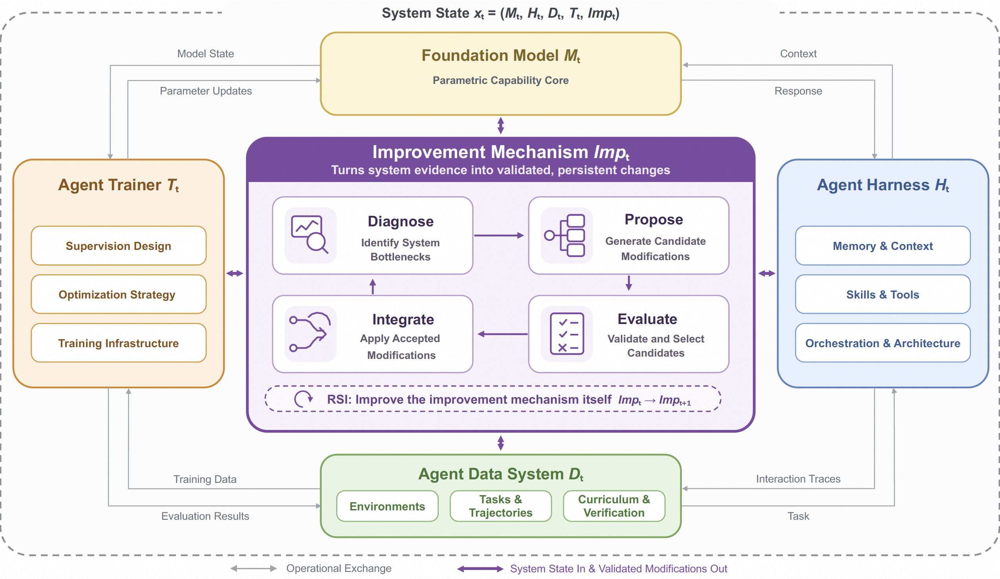
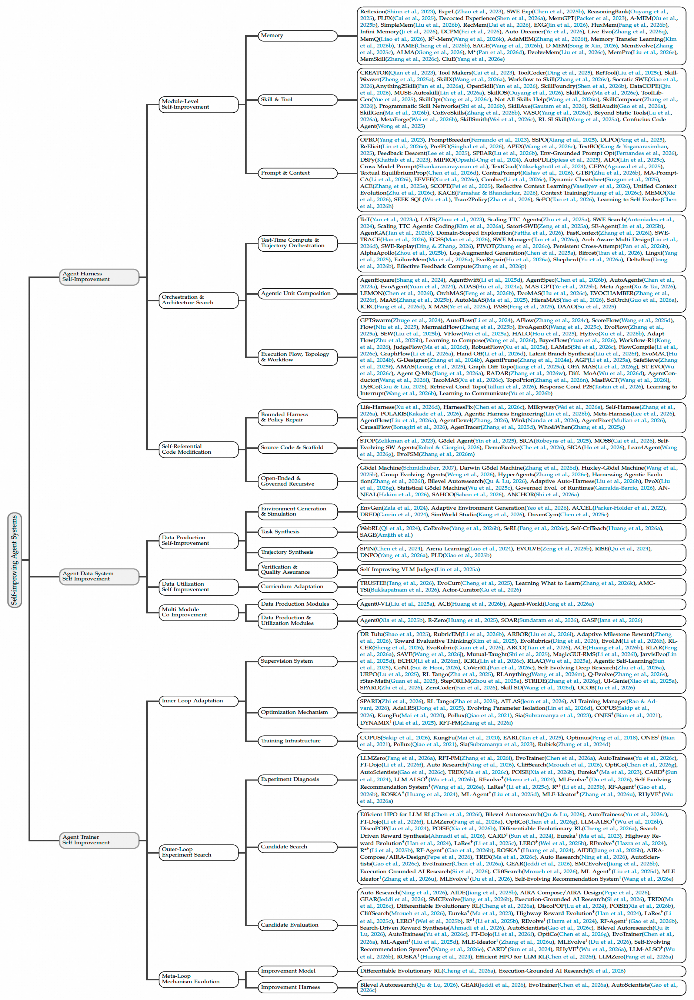

<div align="center">

# The Path to Recursive Self-Improving Agents: Foundation, Framework, and Future Directions

Shuaiqi Liu\*, Zhengkai Lin\*, Yuxiang Zhang\*, Yuanyi Ren\*, Yue Wu, Yongbin Li, Zheng Wang, Zhihang Fu\*, Jieping Ye<br>
**Alibaba Group**

[](https://www.preprints.org/frontend/manuscript/3c41418aa2e782b90ee5da995565ecac/download_pub)
[](https://d2i-ai.github.io/awesome-recursive-self-improving-agents/)
[](#living-survey-index)
[](#contributing)

**English** | [中文版](./README.zh-CN.md)

[Full Text](https://www.preprints.org/manuscript/202608.0051)

A living survey and structured literature map for **self-improving agent systems**: systems that transform experience and evaluation feedback into persistent updates to their own components, moving toward **recursive self-improving agents**.

</div>

---

## Overview

This repository accompanies the survey **“The Path to Recursive Self-Improving Agents: Foundation, Framework, and Future Directions.”** 

The survey studies agent systems that can autonomously convert execution traces, training signals, validation results, and other feedback into durable changes to their own components. It formalizes the agent system as:

$$
x_t = (\mathcal{M}_t, \mathcal{H}_t, \mathcal{D}_t, \mathcal{T}_t, \mathit{Imp}_t)
$$

where \(\mathcal{M}\) is the foundation model, \(\mathcal{H}\) is the agent harness, \(\mathcal{D}\) is the agent data system, \(\mathcal{T}\) is the agent trainer, and \(\mathit{Imp}\) is the improvement mechanism. A self-improving system follows the update rule:

$$
x_{t+1} = \mathit{Imp}_t(x_t)
$$

Recursive self-improvement (RSI) appears when \(\mathit{Imp}_t\) is itself part of the modifiable system state and can become \(\mathit{Imp}_{t+1}\), allowing the system to improve its own future improvement process.

## Why This Survey Matters

The paper makes four main contributions:

- **Formal foundation**: It defines agent-system self-improvement and recursive self-improvement, then introduces a five-level capability grading standard from manual improvement to general recursive self-improvement.
- **Unified framework**: It models the foundation model, agent harness, agent data system, agent trainer, and improvement mechanism as a coupled evolving system.
- **Taxonomy of existing work**: It organizes research into agent harness self-improvement, agent data system self-improvement, agent trainer self-improvement, and cross-component co-improvement.
- **Roadmap for future research**: It identifies open problems around long-horizon evaluation, modifiable infrastructure, bounded-to-general RSI, safety, and human-agent co-improvement.

## Core Framework



The unified framework emphasizes two questions:

- **What can be improved?** The autonomous improvement scope may include the **model**, **harness**, **data system**, **trainer**, and eventually the **improvement mechanism** itself.
- **How does improvement proceed?** The **improvement mechanism** process includes diagnosing bottlenecks, proposing candidate modifications, evaluating and selecting candidates, and integrating accepted changes into persistent system state.

## L1–L5 Capability Grading

The survey distinguishes self-improving systems by autonomy in the improvement loop, whether the improvement mechanism is mutable, and whether the capability generalizes across domains.

| Level | Category Name | Autonomous Proposal | Autonomous Implementation | Autonomous Validation | Improve the Improvement Mechanism | Domain Generality |
|---|---|---|---|---|---|---|
| **L1** | Manual Improvement |  |  |  |  |  |
| **L2** | Assisted Improvement | ✓ |  |  |  |  |
| **L3** | Programmatic Self-Improvement | ✓ | ✓ | ✓ |  |  |
| **L4** | Bounded Recursive Self-Improvement | ✓ | ✓ | ✓ | ✓ |  |
| **L5** | General Recursive Self-Improvement | ✓ | ✓ | ✓ | ✓ | ✓ |

- **L1 — Manual Improvement:** This type of agent system has no autonomous improvement capability. It is deployed and executed in a fixed form, and every change requires a manual development and deployment process.
- **L2 — Assisted Improvement:** This type of system can propose candidate modifications or provide diagnostic evidence, but humans remain responsible for validating and applying substantive changes. The improvement mechanism `Imp` is human-maintained, so L2 is a precursor to self-improvement rather than a full instance of it.
- **L3 — Programmatic Self-Improvement:** This type of system can autonomously propose, apply, and validate modifications to operational components such as the foundation model, agent harness, data system, or trainer. However, `Imp` remains fixed or externally maintained.
- **L4 — Bounded Recursive Self-Improvement:** This type of system can not only propose, validate, and apply candidate modifications, but also rewrite its own improvement mechanism, making the improvement process self-referential. The process supports sustained long-term progress within a bounded domain.
- **L5 — General Recursive Self-Improvement:** L5 retains the autonomy, self-reference, and long-term progress of L4, while transferring improvement capability across broad and evolving task domains rather than remaining limited to a fixed benchmark or narrow operational setting.


## Living Survey Index


## Taxonomy




### Agent Harness Self-Improvement

The harness is the execution layer that determines what the model observes, what actions it can invoke, and how observations and actions are organized into task workflows. Harness self-improvement means converting traces, evaluation feedback, and failures into persistent changes to memory, skills, prompts, workflows, tools, or executable scaffolds.

#### Module-Level Self-Improvement: Memory

This category of work primarily modifies experience memory, retrieval rules, and memory architecture, turning execution traces into reusable, persistent state that conditions later behavior.

| Paper | Link | Year | Level |
|---|---|---|---|
| Reflexion | [link](http://papers.nips.cc/paper_files/paper/2023/hash/1b44b878bb782e6954cd888628510e90-Abstract-Conference.html) | 2023 | L3 |
| SWE-Exp | [link](https://doi.org/10.48550/arXiv.2507.23361) | 2025 | L3 |
| ReasoningBank | [link](https://doi.org/10.48550/arXiv.2509.25140) | 2025 | L3 |
| FLEX | [link](https://doi.org/10.48550/arXiv.2511.06449) | 2025 | L3 |
| Decocted Experience | [link](https://doi.org/10.48550/arXiv.2604.04373) | 2026 | L3 |
| Live-Evo | [link](https://doi.org/10.48550/arXiv.2602.02369) | 2026 | L3 |
| Memory Transfer Learning | [link](https://doi.org/10.48550/arXiv.2604.14004) | 2026 | L3 |

#### Module-Level Self-Improvement: Skill & Tool

This category of work primarily modifies skill libraries, tool libraries, or the shared skill-tool ecosystem that agents retrieve, compose, and reuse.

| Paper | Link | Year | Level |
|---|---|---|---|
| Tool Makers | [link](https://doi.org/10.48550/arXiv.2305.17126) | 2023 | L3 |
| ToolCoder | [link](https://doi.org/10.48550/arXiv.2502.11404) | 2025 | L3 |
| SkillWeaver | [link](https://doi.org/10.48550/arXiv.2504.07079) | 2025 | L3 |
| SkillX | [link](https://doi.org/10.48550/arXiv.2604.04804) | 2026 | L3 |
| Workflow-to-Skill | [link](https://api.semanticscholar.org/CorpusID:288984666) | 2026 | L3 |
| SkillFoundry | [link](https://doi.org/10.48550/arXiv.2604.03964) | 2026 | L3 |
| OpenSkill | [link](https://api.semanticscholar.org/CorpusID:288985167) | 2026 | L3 |
| SkillOS | [link](https://doi.org/10.48550/arXiv.2605.06614) | 2026 | L3 |
| SkillComposer | [link](https://api.semanticscholar.org/CorpusID:288976819) | 2026 | L3 |
| Programmatic Skill Networks | [link](https://doi.org/10.48550/arXiv.2601.03509) | 2026 | L3 |
| SkillAxe | [link](https://api.semanticscholar.org/CorpusID:289132024) | 2026 | L3 |
| SkillAudit | [link](https://api.semanticscholar.org/CorpusID:289209628) | 2026 | L3 |
| SkillGen | [link](https://doi.org/10.48550/arXiv.2605.10999) | 2026 | L3 |
| CoEvoSkills | [link](https://doi.org/10.48550/arXiv.2604.01687) | 2026 | L3 |
| SkillSmith | [link](https://api.semanticscholar.org/CorpusID:288861429) | 2026 | L3 |
| Confucius Code Agent | [link](https://doi.org/10.48550/arXiv.2512.10398) | 2025 | L3 |

#### Module-Level Self-Improvement: Prompt & Context

This category of work primarily modifies prompt programs, context playbooks, guideline documents, or decision-rule libraries; a small subset also makes the prompt optimizer itself mutable.

| Paper | Link | Year | Level |
|---|---|---|---|
| Dynamic Cheatsheet | [link](https://doi.org/10.48550/arXiv.2504.07952) | 2025 | L3 |
| ACE (Context Engineering) | [link](https://doi.org/10.48550/arXiv.2510.04618) | 2025 | L3 |
| SCOPE | [link](https://doi.org/10.48550/arXiv.2512.15374) | 2025 | L3 |
| Reflective Context Learning | [link](https://doi.org/10.48550/arXiv.2604.03189) | 2026 | L3 |
| Unified Context Evolution | [link](https://api.semanticscholar.org/CorpusID:288861191) | 2026 | L3 |
| KACE | [link](https://api.semanticscholar.org/CorpusID:288855241) | 2026 | L3 |
| MEMO | [link](https://doi.org/10.48550/arXiv.2603.09022) | 2026 | L3 |
| SEEK-SQL | [link](https://openreview.net/forum?id=tgnbgt3Ctr) | 2026 | L3 |
| GEPA | [link](https://api.semanticscholar.org/CorpusID:280046245) | 2025 | L3 |
| Trace2Policy | [link](https://api.semanticscholar.org/CorpusID:289131919) | 2026 | L3 |
| Learning to Self-Evolve | [link](https://doi.org/10.48550/arXiv.2603.18620) | 2026 | L3 |
| SePO | [link](https://api.semanticscholar.org/CorpusID:288939508) | 2026 | L4 |

#### Orchestration & Architecture Search

This category of work primarily modifies trajectory orchestration, agent composition, or workflow/communication topology, so the harness spends compute where uncertainty is high and reuses useful intermediate results.

| Paper | Link | Year | Level |
|---|---|---|---|
| AgentGA | [link](https://doi.org/10.48550/arXiv.2604.14655) | 2026 | L3 |
| SWE-Replay | [link](https://doi.org/10.48550/arXiv.2601.22129) | 2026 | L3 |
| Log-Augmented Generation | [link](https://doi.org/10.48550/arXiv.2505.14398) | 2025 | L3 |
| FailureMem | [link](https://doi.org/10.48550/arXiv.2603.17826) | 2026 | L3 |
| EvoRepair | [link](https://doi.org/10.48550/arXiv.2605.30105) | 2026 | L3 |
| EvoAgent | [link](https://doi.org/10.48550/arXiv.2406.14228) | 2024 | L3 |
| ADAS | [link](https://doi.org/10.48550/arXiv.2408.08435) | 2024 | L3 |
| EvoMAS | [link](https://api.semanticscholar.org/CorpusID:285401259) | 2026 | L3 |
| EVOCHAMBER | [link](https://doi.org/10.48550/arXiv.2605.11136) | 2026 | L3 |
| MermaidFlow | [link](https://doi.org/10.48550/arXiv.2505.22967) | 2025 | L3 |
| EvoAgentX | [link](https://doi.org/10.48550/arXiv.2507.03616) | 2025 | L3 |
| EvoFlow | [link](https://doi.org/10.48550/arXiv.2502.07373) | 2025 | L3 |
| SEW | [link](https://doi.org/10.48550/arXiv.2505.18646) | 2025 | L3 |
| HyEvo | [link](https://doi.org/10.48550/arXiv.2603.19639) | 2026 | L3 |
| AdaptFlow | [link](https://doi.org/10.48550/arXiv.2508.08053) | 2025 | L3 |
| JudgeFlow | [link](https://doi.org/10.48550/arXiv.2601.07477) | 2026 | L3 |
| Lean4Agent / LeanEvolve | [link](https://api.semanticscholar.org/CorpusID:288985140) | 2026 | L3 |
| EvoFSM | [link](https://doi.org/10.48550/arXiv.2601.09465) | 2026 | L3 |
| ScoreFlow | [link](https://doi.org/10.48550/arXiv.2502.04306) | 2025 | L3 |
| Learning to Compose | [link](https://doi.org/10.48550/arXiv.2602.11114) | 2026 | L3 |
| Workflow-R1 | [link](https://doi.org/10.48550/arXiv.2602.01202) | 2026 | L3 |
| Learning to Hand Off | [link](https://doi.org/10.48550/arXiv.2605.19140) | 2026 | L3 |
| AutoTTS | [link](https://arxiv.org/abs/2605.08083) | 2026 | L3 |

#### Self-Referential Code Modification

This category of work primarily modifies harness policy, runtime scaffold, agent source code, or the improvement mechanism itself, making the modified agent part of the mechanism that produces further changes.

| Paper | Link | Year | Level |
|---|---|---|---|
| Life-Harness | [link](https://doi.org/10.48550/arXiv.2605.22166) | 2026 | L3 |
| HarnessFix | [link](https://api.semanticscholar.org/CorpusID:288976639) | 2026 | L3 |
| Milkyway | [link](https://doi.org/10.48550/arXiv.2604.15719) | 2026 | L3 |
| Self-Harness | [link](https://api.semanticscholar.org/CorpusID:289097755) | 2026 | L3 |
| POLARIS | [link](https://doi.org/10.48550/arXiv.2603.23129) | 2026 | L3 |
| DemoEvolve | [link](https://doi.org/10.48550/arXiv.2605.24539) | 2026 | L3 |
| SIGA | [link](https://api.semanticscholar.org/CorpusID:289097462) | 2026 | L3 |
| HarnessForge | [link](https://api.semanticscholar.org/CorpusID:288861123) | 2026 | L3 |
| Agentic Harness Engineering | [link](https://doi.org/10.48550/arXiv.2604.25850) | 2026 | L3 |
| Meta-Harness | [link](https://doi.org/10.48550/arXiv.2603.28052) | 2026 | L3 |
| AgentFlow | [link](https://doi.org/10.48550/arXiv.2604.20801) | 2026 | L3 |
| Adaptive Auto-Harness | [link](https://api.semanticscholar.org/CorpusID:288862343) | 2026 | L3 |
| Group-Evolving Agents | [link](https://doi.org/10.48550/arXiv.2602.04837) | 2026 | L3 |
| Gödel Agent | [link](https://aclanthology.org/2025.acl-long.1354/) | 2025 | L4 |
| SICA | [link](https://doi.org/10.48550/arXiv.2504.15228) | 2025 | L4 |
| Darwin Gödel Machine | [link](https://openreview.net/forum?id=pUpzQZTvGY) | 2026 | L4 |
| Huxley-Gödel Machine | [link](https://doi.org/10.48550/arXiv.2510.21614) | 2025 | L4 |
| Red Queen Gödel Machine | [link](https://arxiv.org/abs/2606.26294) | 2026 | L4 |
| HyperAgents | [link](https://doi.org/10.48550/arXiv.2603.19461) | 2026 | L4 |
| Harnessing Agentic Evolution | [link](https://doi.org/10.48550/arXiv.2605.13821) | 2026 | L4 |
| EvoX | [link](https://doi.org/10.48550/arXiv.2602.23413) | 2026 | L4 |
| ANCHOR | [link](https://api.semanticscholar.org/CorpusID:288977221) | 2026 | L3 |
| Statistical Gödel Machine | [link](https://doi.org/10.48550/arXiv.2510.10232) | 2025 | L3 |
| ANNEAL | [link](https://doi.org/10.48550/arXiv.2605.16309) | 2026 | L3 |

### Agent Data System Self-Improvement

The agent data system manages the lifecycle of training and evaluation data. It includes **data production** and **data utilization**, connecting inference-time interaction records with persistent learning in the trainer.

#### Environment Generation & Simulation

This category of work primarily modifies environment configurations, simulators, or the tool/skill libraries used to construct environments, keeping training environments aligned with the agent's evolving capability boundary.

| Paper | Link | Year | Level |
|---|---|---|---|
| EnvGen | [link](https://arxiv.org/abs/2403.12014) | 2024 | L3 |
| Adaptive Environment Generation | [link](https://arxiv.org/abs/2602.06366) | 2026 | L3 |
| ACCEL | [link](https://arxiv.org/abs/2203.01302) | 2022 | L3 |
| DRED | [link](https://arxiv.org/abs/2402.03479) | 2024 | L3 |
| SimWorld Studio | [link](https://arxiv.org/abs/2605.09423) | 2026 | L3 |
| DreamGym | [link](https://arxiv.org/abs/2511.03773) | 2025 | L3 |

#### Task Synthesis

This category of work primarily modifies task instructions, constraints, or evaluation criteria, using diagnostic feedback, fixed quality-control signals, or competitive feedback to keep tasks relevant and appropriately difficult.

| Paper | Link | Year | Level |
|---|---|---|---|
| WebRL | [link](https://arxiv.org/abs/2411.02337) | 2024 | L3 |
| CoEvolve | [link](https://aclanthology.org/2026.acl-long.1055/) | 2026 | L3 |
| SeRL | [link](https://arxiv.org/abs/2505.20347) | 2026 | L3 |
| Self-CriTeach | [link](https://arxiv.org/abs/2509.21543) | 2026 | L3 |
| SAGE | [link](https://openreview.net/forum?id=b3dPMokQki) | 2026 | L3 |

#### Trajectory Synthesis

This category of work primarily modifies solution trajectories, self-play data, or preference data that record agent experience for a given task.

| Paper | Link | Year | Level |
|---|---|---|---|
| SPIN | [link](https://arxiv.org/abs/2401.01335) | 2024 | L3 |
| Arena Learning | [link](https://arxiv.org/abs/2407.10627) | 2024 | L3 |
| EVOLVE | [link](https://arxiv.org/abs/2502.05605) | 2025 | L3 |
| DNPO | [link](https://arxiv.org/abs/2502.05400) | 2026 | L3 |
| PLD | [link](https://arxiv.org/abs/2511.00091) | 2025 | L3 |

#### Verification & Quality Assurance

This category of work primarily modifies judge models, validators, or quality filters that determine which synthesized data is retained.

| Paper | Link | Year | Level |
|---|---|---|---|
| Self-Improving VLM Judges | [link](https://arxiv.org/abs/2512.05145) | 2025 | L3 |

#### Curriculum Adaptation

This category of work primarily modifies the curriculum scheduler, task allocation, or difficulty adaptation that determines how produced data are selected and ordered for training.

| Paper | Link | Year | Level |
|---|---|---|---|
| AMC-TSI | [link](https://openreview.net/forum?id=GjoUJTfXiW) | 2026 | L3 |
| EvoCurr | [link](https://arxiv.org/abs/2508.09586) | 2025 | L3 |
| TRUSTEE | [link](https://arxiv.org/abs/2604.17739) | 2026 | L3 |
| Actor-Curator | [link](https://arxiv.org/abs/2602.20532) | 2026 | L3 |

#### Multi-Module Co-Improvement (within the Data System)

This category of work primarily couples two or more data-production or data-utilization modules through feedback loops, so multiple modules improve collaboratively rather than in isolation.

| Paper | Link | Year | Level |
|---|---|---|---|
| Agent0-VL | [link](https://arxiv.org/abs/2511.19900) | 2025 | L3 |
| ACE (Adversarial Code Evolution) | [link](https://arxiv.org/abs/2605.16299) | 2026 | L3 |
| Agent-World | [link](https://arxiv.org/abs/2604.18292) | 2026 | L3 |
| Agent0 | [link](https://arxiv.org/abs/2511.16043) | 2025 | L3 |
| R-Zero | [link](https://arxiv.org/abs/2508.05004) | 2025 | L3 |

### Agent Trainer Self-Improvement

The trainer converts agent experience into persistent model updates. Trainer self-improvement revises the persistent state that determines supervision, optimization, infrastructure, or the mechanism that improves the trainer itself.

#### Inner-Loop Trainer Adaptation

This loop modifies persistent trainer state, such as a reward model, verifier, rubric memory, process reward model, batch-size controller, or infrastructure configuration, within an active training lineage while the improvement mechanism remains fixed.

| Paper | Link | Year | Level |
|---|---|---|---|
| ACE (Adversarial Code Evolution) | [link](https://arxiv.org/abs/2605.16299) | 2026 | L3 |
| AdaLRS | [link](https://openreview.net/forum?id=Rc489jcc30) | 2025 | L3 |
| ADMIRE | [link](https://arxiv.org/abs/2602.11524) | 2026 | L3 |
| ASL | [link](https://arxiv.org/abs/2510.14253) | 2025 | L3 |
| AI Training Manager | [link](https://arxiv.org/abs/2606.29871) | 2026 | L3 |
| ARBOR | [link](https://arxiv.org/abs/2606.03239) | 2026 | L3 |
| ARCO | [link](https://arxiv.org/abs/2606.21262) | 2026 | L3 |
| ATLAS | [link](https://arxiv.org/abs/2602.02709) | 2026 | L3 |
| CoNL | [link](https://arxiv.org/abs/2601.21464) | 2026 | L3 |
| COPUS | [link](https://arxiv.org/abs/2604.26687) | 2026 | L3 |
| CoVerRL | [link](https://arxiv.org/abs/2603.17775) | 2026 | L3 |
| DR Tulu | [link](https://arxiv.org/abs/2511.19399) | 2025 | L3 |
| DYNAMIX | [link](https://arxiv.org/abs/2510.08522) | 2025 | L3 |
| EARL | [link](https://arxiv.org/abs/2510.05943) | 2025 | L3 |
| ECHO | [link](https://arxiv.org/abs/2601.06794) | 2026 | L3 |
| EvoLM | [link](https://arxiv.org/abs/2605.03871) | 2026 | L3 |
| EPI | [link](https://arxiv.org/abs/2604.14010) | 2026 | L3 |
| EvoRubric | [link](https://arxiv.org/abs/2605.29847) | 2026 | L3 |
| EvoRubrics | [link](https://arxiv.org/abs/2606.23038) | 2026 | L3 |
| ICRL | [link](https://arxiv.org/abs/2605.15224) | 2026 | L3 |
| JarvisEvo | [link](https://arxiv.org/abs/2511.23002) | 2025 | L3 |
| KungFu | [link](https://www.usenix.org/conference/osdi20/presentation/mai) | 2020 | L3 |
| MagicGUI-RMS | [link](https://arxiv.org/abs/2601.13060) | 2026 | L3 |
| Mutual-Taught | [link](https://arxiv.org/abs/2506.06292) | 2025 | L3 |
| ONES | [link](https://arxiv.org/abs/2108.03645) | 2021 | L3 |
| Optimus | [link](https://doi.org/10.1145/3190508.3190517) | 2018 | L3 |
| Pollux | [link](https://www.usenix.org/conference/osdi21/presentation/qiao) | 2021 | L3 |
| Q-Evolve | [link](https://arxiv.org/abs/2606.07367) | 2026 | L3 |
| RFT-FM | [link](https://arxiv.org/abs/2605.04431) | 2026 | L3 |
| RLAC | [link](https://arxiv.org/abs/2511.01758) | 2025 | L3 |
| RLAnything | [link](https://arxiv.org/abs/2602.02488) | 2026 | L3 |
| RLAR | [link](https://arxiv.org/abs/2603.00724) | 2026 | L3 |
| RLCER | [link](https://arxiv.org/abs/2602.10885) | 2026 | L3 |
| RL Tango | [link](https://arxiv.org/abs/2505.15034) | 2025 | L3 |
| rStar-Math | [link](https://arxiv.org/abs/2501.04519) | 2025 | L3 |
| Rubick | [link](https://arxiv.org/abs/2408.08586) | 2024 | L3 |
| RubricEM | [link](https://arxiv.org/abs/2605.10899) | 2026 | L3 |
| SAVE | [link](https://arxiv.org/abs/2605.30888) | 2026 | L3 |
| SCORE | [link](https://arxiv.org/abs/2606.04507) | 2026 | L3 |
| Sia | [link](https://doi.org/10.1145/3600006.3613175) | 2023 | L3 |
| Skill-SD | [link](https://arxiv.org/abs/2604.10674) | 2026 | L3 |
| SPARD | [link](https://arxiv.org/abs/2604.07837) | 2026 | L3 |
| StepORLM | [link](https://arxiv.org/abs/2509.22558) | 2025 | L3 |
| STRIDE | [link](https://arxiv.org/abs/2605.18851) | 2026 | L3 |
| Evaluative Thinking | [link](https://arxiv.org/abs/2504.20157) | 2025 | L3 |
| UCOB | [link](https://arxiv.org/abs/2606.29502) | 2026 | L3 |
| UI-Genie | [link](https://arxiv.org/abs/2505.21496) | 2025 | L3 |
| URPO | [link](https://arxiv.org/abs/2507.17515) | 2025 | L3 |
| ZeroCoder | [link](https://arxiv.org/abs/2604.07864) | 2026 | L3 |

#### Outer-Loop Trainer Search through Experiments

This loop modifies a training script, reward code, fine-tuning recipe, optimizer code, or training pipeline across bounded experiments, under a fixed improvement mechanism that proposes and evaluates trainer candidates.

| Paper | Link | Year | Level |
|---|---|---|---|
| AIDE | [link](https://arxiv.org/abs/2502.13138) | 2025 | L3 |
| AIRA-Design | [link](https://arxiv.org/abs/2605.15871) | 2026 | L3 |
| Auto Research | [link](https://arxiv.org/abs/2605.05724) | 2026 | L3 |
| AutoTrainess | [link](https://arxiv.org/abs/2606.31551) | 2026 | L3 |
| CARD | [link](https://arxiv.org/abs/2410.14660) | 2024 | L3 |
| CliffSearch | [link](https://arxiv.org/abs/2604.01210) | 2026 | L3 |
| DiscoPOP | [link](https://arxiv.org/abs/2406.08414) | 2024 | L3 |
| LLM-RL HPO | [link](https://arxiv.org/abs/2606.03073) | 2026 | L3 |
| Eureka | [link](https://arxiv.org/abs/2310.12931) | 2023 | L3 |
| FT-Dojo | [link](https://arxiv.org/abs/2603.01712) | 2026 | L3 |
| Highway Reward Evolution | [link](https://arxiv.org/abs/2406.10540) | 2024 | L3 |
| LaRes | [link](https://proceedings.neurips.cc/paper_files/paper/2025/hash/21b5d3a17aa5525f30bfd2bc59ac3a48-Abstract-Conference.html) | 2025 | L3 |
| LERO | [link](https://arxiv.org/abs/2503.21807) | 2025 | L3 |
| LLM-ALSO | [link](https://arxiv.org/abs/2605.29293) | 2026 | L3 |
| LLMZero | [link](https://arxiv.org/abs/2606.18388) | 2026 | L3 |
| MLEvolve | [link](https://arxiv.org/abs/2606.06473) | 2026 | L3 |
| OptiCo | [link](https://aclanthology.org/2026.acl-long.1283/) | 2026 | L3 |
| POISE | [link](https://arxiv.org/abs/2603.23951) | 2026 | L3 |
| R\* | [link](https://proceedings.mlr.press/v267/li25v.html) | 2025 | L3 |
| REvolve | [link](https://arxiv.org/abs/2406.01309) | 2024 | L3 |
| RF-Agent | [link](https://arxiv.org/abs/2602.23876) | 2026 | L3 |
| RHyVE | [link](https://arxiv.org/abs/2604.28056) | 2026 | L3 |
| ROSKA | [link](https://arxiv.org/abs/2412.13492) | 2024 | L3 |
| Reward Synthesis | [link](https://arxiv.org/abs/2605.02073) | 2026 | L3 |
| Self-Evolving Recommender | [link](https://arxiv.org/abs/2602.10226) | 2026 | L3 |
| SMCEvolve | [link](https://arxiv.org/abs/2605.15308) | 2026 | L3 |
| TREX | [link](https://arxiv.org/abs/2604.14116) | 2026 | L3 |

#### Meta-Loop Improvement-Mechanism Evolution

This loop modifies the persistent improvement mechanism itself, e.g., a search runner, diagnostic harness, improvement model, or improvement harness, across successive trainer-improvement cycles.

| Paper | Link | Year | Level |
|---|---|---|---|
| AutoScientists | [link](https://arxiv.org/abs/2605.28655) | 2026 | L4 |
| Bilevel Autoresearch | [link](https://doi.org/10.48550/arXiv.2603.23420) | 2026 | L4 |
| DERL | [link](https://arxiv.org/abs/2512.13399) | 2026 | L4 |
| EvoTrainer | [link](https://arxiv.org/abs/2606.03108) | 2026 | L4 |
| GEAR | [link](https://arxiv.org/abs/2605.13874) | 2026 | L4 |
| Execution-Grounded AI Research | [link](https://arxiv.org/abs/2601.14525) | 2026 | L4 |

### Cross-Component Co-Improvement

Single-component self-improvement is often insufficient because system-level bottlenecks shift as components evolve. **Co-improvement** studies feedback loops across multiple components.

#### Harness–Trainer Co-Improvement

Improved skills, tools, workflows, or scaffolds make training signals more informative, while training feedback reveals which harness modules should be revised next.

| Paper | Link | Year | Level |
|---|---|---|---|
| SkillRL | [link](https://doi.org/10.48550/arXiv.2602.08234) | 2026 | L3 |
| ARISE | [link](https://doi.org/10.48550/arXiv.2603.16060) | 2026 | L3 |
| SIA | [link](https://doi.org/10.48550/arXiv.2605.27276) | 2026 | L3 |
| HarnessForge | [link](https://api.semanticscholar.org/CorpusID:288861123) | 2026 | L3 |

#### Harness–Data Co-Improvement

Harness modules change the data the agent system can produce or access, while data-side signals drive the creation and refinement of those harness modules.

| Paper | Link | Year | Level |
|---|---|---|---|
| CODESKILL | [link](https://doi.org/10.48550/arXiv.2605.25430) | 2026 | L3 |
| VOYAGER | [link](https://doi.org/10.48550/arXiv.2305.16291) | 2023 | L3 |
| Live-SWE-agent | [link](https://doi.org/10.48550/arXiv.2511.13646) | 2025 | L3 |
| AutoHarness | [link](https://doi.org/10.48550/arXiv.2603.03329) | 2026 | L3 |

#### Data–Trainer Co-Improvement

Better training produces better data, which in turn improves training, forming a feedback loop between an environment/world model and the policy.

| Paper | Link | Year | Level |
|---|---|---|---|
| WebEvolver | [link](https://arxiv.org/abs/2504.21024) | 2025 | L3 |
| VLAW | [link](https://arxiv.org/abs/2602.12063) | 2026 | L3 |

## Open Problems

The survey highlights five open problems for moving from current self-improving agent systems toward reliable and general RSI Agents:

- **Long-horizon real-world evaluation**: Benchmarks should test whether repeated self-modification improves reliability, robustness, usefulness, capability retention, and the improvement process itself under evolving workloads, goals, budgets, tools, and environments.
- **Observable, scalable, and modifiable training and inference infrastructure**: RSI needs unified, agent-friendly representations of execution traces, training records, validation results, version histories, and resource usage so agents can observe, reproduce, compare, and safely revise the improvement process.
- **From bounded recursive self-improvement to general recursive self-improvement**: The key challenge is to make improvement mechanisms transferable across domains while avoiding the inappropriate transfer of task-specific strategies that fail in new settings.
- **Safety and controllability under recursive self-modification**: Systems must keep capability-oriented components modifiable while protecting governance components through stricter verification, continuous monitoring, rollback versions, safety alerts, incident logs, and human review.
- **Human-expert and agent co-improvement**: High-impact applications need agents that know when to involve experts, choose the right interaction form, provide interpretable evidence, and convert expert feedback into reusable improvement resources.

## Contributing

This repository is intended to become a community-maintained living survey.

When adding or revising a paper entry, please include:

- **Title and link**
- **Venue and year**
- **Component**: Harness Self-Improvement, Data System Self-Improvement, Trainer Self-Improvement, or Multi-Component Co-Improvement
- **Subcategory**: e.g., Memory, Task Synthesis, Inner-Loop Trainer Adaptation
- **L-level**: L1–L5
- **Domain**
- **Rationale**: cite concrete evidence for the component and L-level judgment

If there is a dispute over the grading result of an existing paper, please submit a commit and provide the above information, the proposed level, and relevant evidence.

## Citation

If you find this survey or repository useful, please cite this paper.

```bibtex
@article{202608.0051,
  doi = {10.20944/preprints202608.0051.v1},
  url = {https://www.preprints.org/manuscript/202608.0051},
  year = 2026,
  month = {August},
  publisher = {Preprints},
  author = {Shuaiqi Liu and Zhengkai Lin and Yuxiang Zhang and Yuanyi Ren and Yue Wu and Yongbin Li and Zheng Wang and Zhihang Fu and Jieping Ye},
  title = {The Path to Recursive Self-Improving Agents: Foundation, Framework, and Future Directions},
  journal = {Preprints}
}
```
